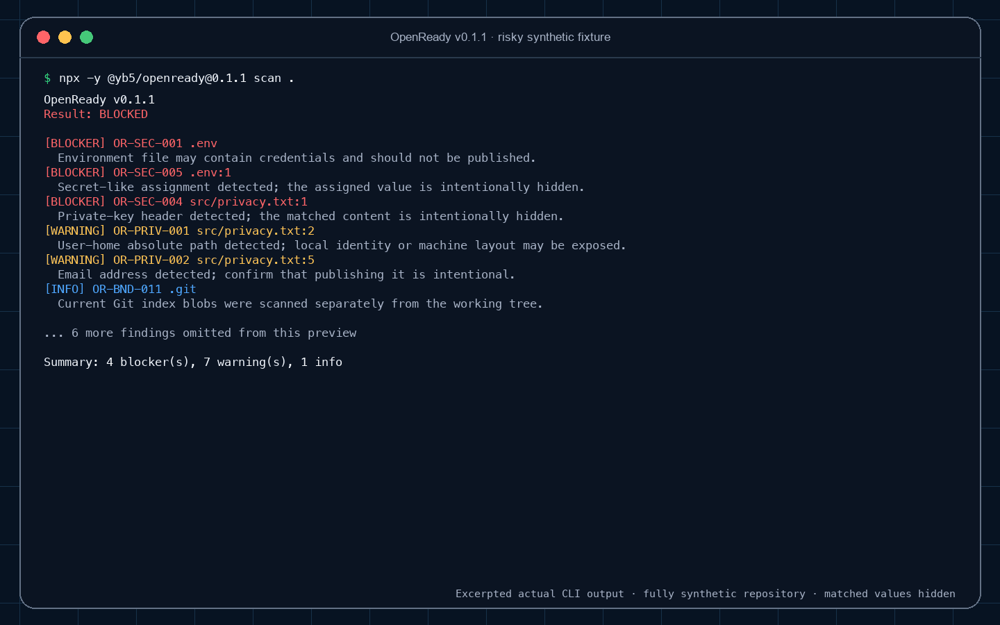

# OpenReady

**Run one local check before you make a Git repository public.**

OpenReady checks for credential-shaped content, personal paths and emails, Git author metadata, risky files, large media, and missing open-source governance files in one read-only scan.

OpenReady v0.2.0 adds a safe first step. Try its output without giving OpenReady access to your repository:

```sh
npx --yes "@yb5/openready@0.2.0" demo
```

- `npx` may download the package before it starts. The demo then runs locally with no telemetry.
- The demo does not scan the current directory. It creates only fixed fictional files in a unique operating-system temporary directory and removes that exact directory after the run.
- The `scan` command changes no files, follows no symlinks, and sends no telemetry.
- Matched secret values and Git identities are never printed.
- It has zero runtime dependencies and requires Node.js 20 or newer. Git is required for the synthetic demo and repository metadata checks.

After the synthetic demo, scan only a repository you are authorized to inspect:

```sh
npx --yes "@yb5/openready@0.2.0" scan .
```



This v0.1.1 recording remains behaviorally representative for the `scan` command in v0.2.0. It uses two fully synthetic Git repositories and excerpted actual CLI output. A scan result is either `BLOCKED`, which exits `1`, or `READY`, which exits `0` but can still contain warnings for human review. The new `demo` command intentionally produces a synthetic `BLOCKED` result but exits `0` when setup, scanning, and cleanup all succeed.

After the synthetic demo, you may share this privacy-safe line in the [launch discussion](https://github.com/yinuobian05-ui/OpenReady/discussions/1):

```text
OS / Node major / OpenReady version / demo completed? / one observation / would try on an authorized repo?
```

That records only an independent synthetic smoke test, not real-repository use or adoption. A verified real-repository test additionally requires the person to scan a repository they are authorized to inspect and give a specific privacy-safe observation.

Do not paste scan output, repository contents, credentials, logs, or personal information.

> OpenReady does not guarantee that a repository is safe to publish. It does not replace a history-aware secret scanner, legal review, or copyright review.

## First scan details

This first run has a design target of under five minutes. No measured human timing or adoption result is claimed yet.

Requirements: Node.js 20 or newer. Git is needed for tracked-file and commit-author checks.

Run the pinned public package from the repository you want to check:

```sh
npx --yes "@yb5/openready@0.2.0" scan .
```

This command downloads the pinned package from npm for the first run. The scan itself is offline, read-only, and has no telemetry.

For JSON output:

```sh
npx --yes "@yb5/openready@0.2.0" scan . --json
```

To pin the source archive instead of using the npm registry:

```sh
npx --yes https://github.com/yinuobian05-ui/OpenReady/archive/v0.2.0.tar.gz scan .
```

If you prefer to inspect and run the source checkout instead:

```sh
git clone --branch v0.2.0 https://github.com/yinuobian05-ui/OpenReady.git
cd OpenReady
node ./bin/openready.js scan /path/to/your-project
```

Optional commands from that checkout:

```sh
node ./bin/openready.js scan /path/to/your-project --json
node ./bin/openready.js demo
node ./bin/openready.js --help
node ./bin/openready.js --version
```

## Optional GitHub Actions check

For a repository that is already hosted on GitHub, this minimal workflow runs the same pinned scan on pull requests and by manual dispatch. It grants only read access to repository contents, does not persist checkout credentials, and pins third-party actions to complete commit SHAs.

```yaml
name: OpenReady

on:
  pull_request:
  workflow_dispatch:

permissions:
  contents: read

jobs:
  scan:
    runs-on: ubuntu-latest
    timeout-minutes: 10
    steps:
      - name: Check out repository
        uses: actions/checkout@3d3c42e5aac5ba805825da76410c181273ba90b1 # v7.0.1
        with:
          fetch-depth: 0
          persist-credentials: false

      - name: Set up Node.js
        uses: actions/setup-node@820762786026740c76f36085b0efc47a31fe5020 # v7.0.0
        with:
          node-version: 24.x
          package-manager-cache: false

      - name: Run OpenReady
        shell: bash
        env:
          npm_config_ignore_scripts: "true"
          npm_config_registry: https://registry.npmjs.org/
        run: |
          cd "$RUNNER_TEMP"
          npx --yes "@yb5/openready@0.2.0" scan "$GITHUB_WORKSPACE"
```

The workflow starts npm outside the checked-out repository, fixes the public registry, and disables package lifecycle scripts before downloading the pinned package. It fails when OpenReady finds a blocker or cannot complete reliably; warnings alone do not fail it. The scan itself remains read-only and sends no telemetry. GitHub Actions logs may reveal relative file paths and rule categories, so keep the local command as the default for material that should not appear in hosted CI logs.

## What the result means

- `BLOCKER` — stop and investigate before publication.
- `WARNING` — manual review is required, but the scan still exits successfully.
- `INFO` — a boundary, skipped content type, or missing optional file is being disclosed.

Finding counts are not file counts. One file can produce several findings when, for example, its name and multiple content lines trigger different rules. A scan with warnings or informational findings, but no blockers, still exits `0`, so automation that cares about those levels should inspect the JSON findings rather than checking only the process status.

Git author warnings intentionally hide names and email addresses. To review the actual identities locally, without sending them anywhere, run:

```sh
git log --all --format='%an <%ae>' | sort -u
```

Missing `README`, license, and security policy checks are warnings because they are important publication decisions. A missing contributing guide is informational because a small project may reasonably add it later. Governance checks verify that a recognized file exists; they do not determine whether a license is legally valid or appropriate.

Exit codes are stable for shell and CI use:

| Code | Meaning |
| ---: | --- |
| `0` | Scan completed with no blockers. |
| `1` | Scan completed and found at least one blocker. |
| `2` | Usage error or the scan could not complete reliably. |

This exact shape comes from a clearly fictional synthetic repository. It demonstrates several rule categories while keeping every matched value hidden:

```text
[BLOCKER] OR-SEC-001 .env
  Environment file may contain credentials and should not be published.
[BLOCKER] OR-SEC-005 .env:1
  Secret-like assignment detected; the assigned value is intentionally hidden.
[BLOCKER] OR-SEC-006 .env:2
  Credential token pattern detected; the matched value is intentionally hidden.
[BLOCKER] OR-SEC-004 src/privacy.txt:1
  Private-key header detected; the matched content is intentionally hidden.
[WARNING] OR-META-001 .git
  Reachable commits contain author names; confirm those identities may be public.
[WARNING] OR-META-002 .git
  Reachable commits contain author emails; confirm those identities may be public.
[WARNING] OR-META-003 .git
  Historical Git file contents were not scanned; use a history-aware secret scanner too.
[WARNING] OR-PRIV-001 src/privacy.txt:2
  User-home absolute path detected; local identity or machine layout may be exposed.
[WARNING] OR-PRIV-001 src/privacy.txt:3
  User-home absolute path detected; local identity or machine layout may be exposed.
[WARNING] OR-PRIV-001 src/privacy.txt:4
  User-home absolute path detected; local identity or machine layout may be exposed.
[WARNING] OR-PRIV-002 src/privacy.txt:5
  Email address detected; confirm that publishing it is intentional.
[INFO] OR-BND-011 .git
  Current Git index blobs were scanned separately from the working tree.

Summary: 4 blocker(s), 7 warning(s), 1 info

Privacy-safe feedback (never paste scan output or repository data):
https://github.com/yinuobian05-ui/OpenReady/discussions/1
OS / Node major / completed? / confusing part / would use again?
```

See the [synthetic pre-release evaluation](docs/pre-beta-evaluation.md) for the evidence boundary, defects found, and checks performed. It is not presented as human beta testing or real-world adoption.

## Checks in v0.2

OpenReady checks:

- environment, private-key, keystore, credential, certificate, and authentication-config filenames;
- private-key headers, high-confidence token shapes, and secret-like assignments;
- macOS, Linux, and Windows user-home path traces;
- email addresses in text files;
- author names and emails stored in reachable Git commits, reported only as aggregate warnings;
- large and oversized files, archives, databases, and media that may contain personal information;
- logs, crash artifacts, backups, and temporary files;
- missing `README`, license, security policy, and contributing guide;
- symlinks, binary files, unreadable entries, Gitlinks, and non-Git directories.

Every finding uses only these fields:

```json
{
  "severity": "WARNING",
  "ruleId": "OR-PRIV-002",
  "description": "Email address detected; confirm that publishing it is intentional.",
  "path": "src/example.js",
  "line": 12
}
```

`line` is omitted when it is not needed. There are no snippet, match, raw-value, author-value, hash, or absolute-root fields.

## Scan scope and safety boundaries

For a normal Git repository, OpenReady scans the current working-tree candidates returned by Git: tracked files plus untracked files that are not ignored by repository-local rules. Tracked paths remain in scope even if an ignore rule also matches them. User-global ignore configuration is deliberately not read, so a file hidden only by a personal global ignore remains a candidate. OpenReady also scans every ordinary file blob in the current Git index as a separate, bounded snapshot, even when that blob matches the working-tree file. For an indexed symlink, OpenReady scans only the stored target string. Untracked files ignored by repository-local rules are not read.

For a non-Git directory, OpenReady recursively checks ordinary entries while excluding Git metadata directories.

OpenReady never traverses a symlink. A link is reported as internal or external, and its target string is checked for privacy traces without opening the target. Text content larger than 10 MiB is not scanned; filename, type, and size rules still run. Binary files, archives, databases, and Gitlinks are not unpacked or parsed.

The CLI also fails closed with exit code `2` instead of returning a partial result when fixed safety budgets are exceeded: 250,000 entries, 512 MiB of bounded content inspection, or 10,000 unique findings per scan.

The scanner is read-only, but it evaluates a live filesystem snapshot. Concurrent file replacement can make any local scan stale. Run it on a repository you trust locally and avoid editing the repository during the scan. Repositories whose Git metadata uses config includes, alternate object stores, shared worktree metadata, partial-clone redirects, or metadata symlinks are rejected instead of following those redirects.

## Important limitations

- Current working-tree content, all ordinary blobs in the current Git index, and indexed symlink target strings are checked. Git commit author metadata is checked, but historical file blobs are not. A credential removed from both the index and current tree may still exist in history.
- Token and assignment rules are intentionally small and offline. They can produce false positives and false negatives, and they do not verify whether a credential is active.
- Very large repositories may exceed a fixed entry, content, finding, Git-output, or Git-command-time budget and exit `2` without a partial result.
- Filesystem or Git paths with non-UTF-8 bytes are rejected with exit `2` rather than decoded ambiguously.
- OpenReady does not contact credential providers, Git hosting services, or analytics services.
- Deleting a real credential from a file is not enough. Revoke or rotate it, then review Git history with a dedicated tool.
- OpenReady does not decide whether you own the rights to publish code, text, images, audio, video, fonts, datasets, or third-party assets.
- OpenReady is not legal advice, a copyright clearance service, or a substitute for human privacy review.

Before making a repository public, also run a maintained, history-aware secret scanner such as Gitleaks or TruffleHog and review the repository on the hosting platform after upload.

## JSON contract

`openready scan [path] --json` writes one JSON document to standard output for a completed scan. Execution errors write one JSON error document to standard error and exit `2`. JSON mode does not add ANSI styling or progress logs.

Top-level fields are:

- `tool` and `version`;
- `root`, always represented as `.` so the local absolute path is not exposed;
- `status`, either `READY` or `BLOCKED`;
- `summary` counts for blockers, warnings, and informational findings;
- `findings`, deterministically sorted by severity, path, line, and rule ID.

## Development

```sh
npm ci --ignore-scripts
npm test
npm pack --dry-run --ignore-scripts
node ./bin/openready.js scan . --json
```

Tests use Node's built-in test runner and generate only clearly fictional fixtures inside `test/.tmp`. No runtime package is installed.

See [CONTRIBUTING.md](CONTRIBUTING.md) for rule and fixture requirements, [SECURITY.md](SECURITY.md) for safe reporting, and [beta-testing.md](beta-testing.md) for an optional future real-user feedback template.

## Project status

This source tree and package metadata are version `0.2.0`. Verify the current public [npm package](https://www.npmjs.com/package/@yb5/openready) and [GitHub release](https://github.com/yinuobian05-ui/OpenReady/releases) at those endpoints; publication is complete only when the npm package, Git tag, and GitHub release agree. OpenReady is maintained by Yinuo Bian (`@yinuobian05-ui`) at [yinuobian05-ui/OpenReady](https://github.com/yinuobian05-ui/OpenReady). GitHub Private Vulnerability Reporting is enabled. No verified independent human run, adoption, review, or impact is claimed. Synthetic demo runs remain a separate smoke-test signal.

Licensed under the MIT License.
